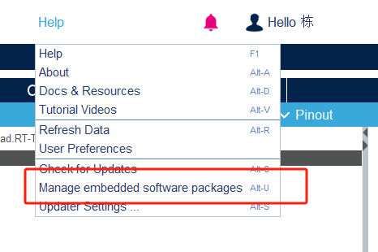
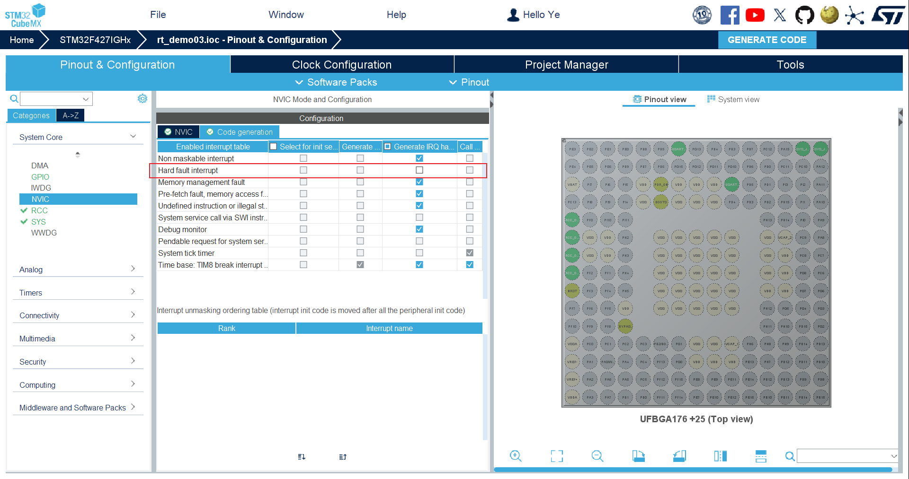
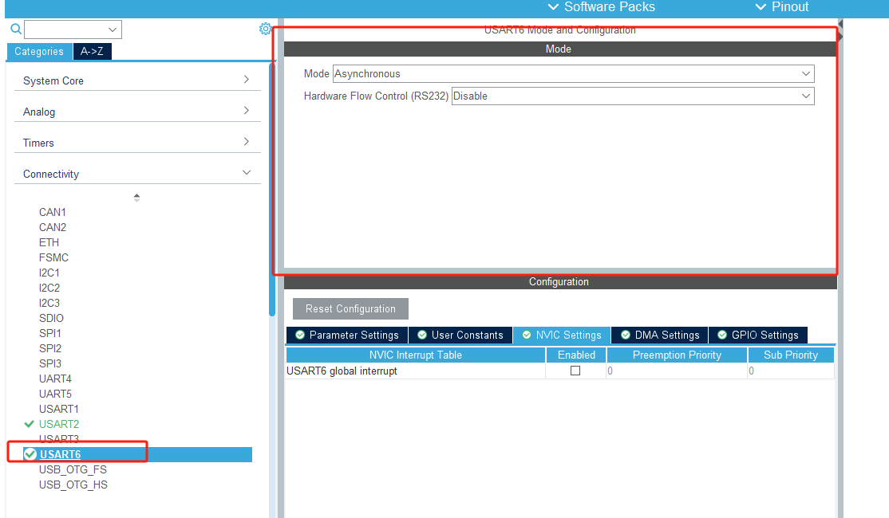

# RT-Thread CubeMX工程移植
> 本篇文章是针对于CubeMX新版本移植RT-Thread nano版本出现的问题进行解决，并且详细的给出CubeMX新界面操作流程

- CubeMX版本：6.1.2
- RT-Thread版本：3.1.5

## 一、构建普通的STM32工程
在本节开始前请先根据官方文档完成[准备工作](https://www.rt-thread.org/document/site/#/rt-thread-version/rt-thread-nano/nano-port-cube/an0041-nano-port-cube?id=%e5%87%86%e5%a4%87%e5%b7%a5%e4%bd%9c)

tips：新版界面有点差异，但都差不多，这里不多赘述




一个空的STM32工程在CubeMX里面主要是配置金证和时钟

开启晶振


首先开启系统时钟


系统时钟配置


## 二、移植RT-Thread

在完成准备工作后，CubeMX就把RT-Thread准备好了，现在只需要把CubeMX添加到工程中


关掉多余的中断


这里建议把串口6设置为调试窗口（与我给的board.c对应）


## 三、生成工程
在"Project Manager"选项卡下，配置工程名称、保持路径、生成的IDE等内容


然后点右上角“GENERATE CODE”，生成项目


## 四、编译工程、解决报错
> 新版本的工程会少一些代码，要求配置工程的人去编写，以至于导致他和老版本的移植流程不一样

### 4.1 对于board.c报错


错误原因：由于新版本的RT-Thread移植要求自行编写board.c这个文件


你会发现“#error”的字样，是提醒你这地方需要你自行写代码，比如说配置调试串口、调试串口数据处理等
如果你不会写，你可以直接复制如下代码到整个board.c文件

```c
/*
 * Copyright (c) 2006-2019, RT-Thread Development Team
 *
 * SPDX-License-Identifier: Apache-2.0
 *
 * Change Logs:
 * Date           Author       Notes
 * 2021-05-24                  the first version
 */

#include <rthw.h>
#include <rtthread.h>

#include "main.h"

#if defined(RT_USING_USER_MAIN) && defined(RT_USING_HEAP)
/*
 * Please modify RT_HEAP_SIZE if you enable RT_USING_HEAP
 * the RT_HEAP_SIZE max value = (sram size - ZI size), 1024 means 1024 bytes
 */
#define RT_HEAP_SIZE (15*1024)
static rt_uint8_t rt_heap[RT_HEAP_SIZE];

RT_WEAK void *rt_heap_begin_get(void)
{
    return rt_heap;
}

RT_WEAK void *rt_heap_end_get(void)
{
    return rt_heap + RT_HEAP_SIZE;
}
#endif

void SysTick_Handler(void)
{
    rt_interrupt_enter();
    
    rt_tick_increase();

    rt_interrupt_leave();
}

/**
 * This function will initial your board.
 */
void rt_hw_board_init(void)
{
    extern void SystemClock_Config(void);
    
    HAL_Init();
    SystemClock_Config();
    SystemCoreClockUpdate();
    /* 
     * 1: OS Tick Configuration
     * Enable the hardware timer and call the rt_os_tick_callback function
     * periodically with the frequency RT_TICK_PER_SECOND. 
     */
    HAL_SYSTICK_Config(HAL_RCC_GetHCLKFreq()/RT_TICK_PER_SECOND);

    /* Call components board initial (use INIT_BOARD_EXPORT()) */
#ifdef RT_USING_COMPONENTS_INIT
    rt_components_board_init();
#endif

#if defined(RT_USING_USER_MAIN) && defined(RT_USING_HEAP)
    rt_system_heap_init(rt_heap_begin_get(), rt_heap_end_get());
#endif
}

#ifdef RT_USING_CONSOLE

static UART_HandleTypeDef UartHandle;
static int uart_init(void)
{
    /* TODO: Please modify the UART port number according to your needs */
    /* 调试串口配置 */
    UartHandle.Instance = USART6;
    UartHandle.Init.BaudRate = 115200;
    UartHandle.Init.WordLength = UART_WORDLENGTH_8B;
    UartHandle.Init.StopBits = UART_STOPBITS_1;
    UartHandle.Init.Parity = UART_PARITY_NONE;
    UartHandle.Init.Mode = UART_MODE_TX_RX;
    UartHandle.Init.HwFlowCtl = UART_HWCONTROL_NONE;
    UartHandle.Init.OverSampling = UART_OVERSAMPLING_16;

    if (HAL_UART_Init(&UartHandle) != HAL_OK)
    {
        while (1);
    }
    return 0;
}
INIT_BOARD_EXPORT(uart_init);

void rt_hw_console_output(const char *str)
{
    rt_size_t i = 0, size = 0;
    char a = '\r';

    __HAL_UNLOCK(&UartHandle);

    size = rt_strlen(str);

    for (i = 0; i < size; i++)
    {
        if (*(str + i) == '\n')
        {
            HAL_UART_Transmit(&UartHandle, (uint8_t *)&a, 1, 1);
        }
        HAL_UART_Transmit(&UartHandle, (uint8_t *)(str + i), 1, 1);
    }
}
#endif

#ifdef RT_USING_FINSH
char rt_hw_console_getchar(void)
{
    /* Note: the initial value of ch must < 0 */
    int ch = -1;

    if (__HAL_UART_GET_FLAG(&UartHandle, UART_FLAG_RXNE) != RESET)
    {
        ch = UartHandle.Instance->DR & 0xff;
    }
    else
    {
        rt_thread_mdelay(10);
    }
    return ch;
}
#endif
```

### 4.2 finsh_config报错

摁下ctrl+F 然后修改成“Current Porject”
搜索rtconfig.h，直到找到rtconfig.h这个文件
tips：如果没有，找到它的引入，右键打开
然后把这个注释取消掉


### 4.3 线程使用报错（关于找不到线程创建函数）
如果你引入了头文件，但编译还是报错找不到线程相关函数
在4.2 rtconfig.h的文件中
取消注释

